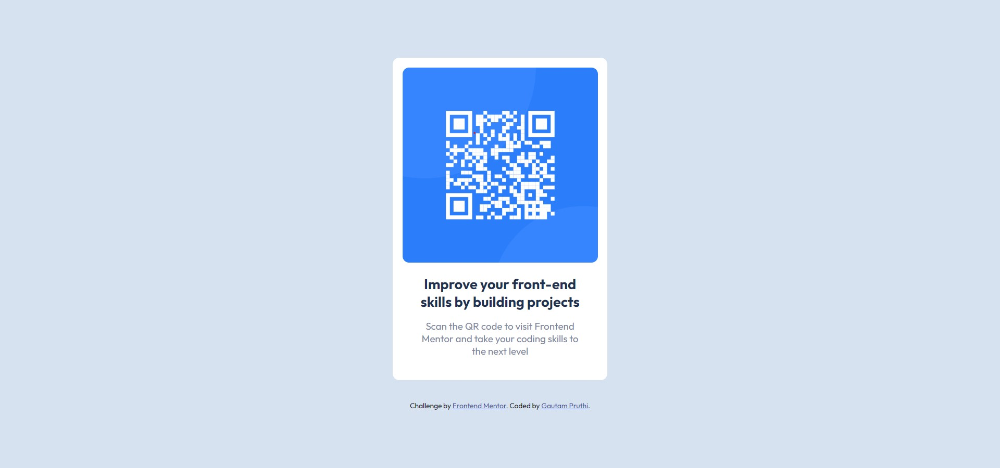

# Frontend Mentor - QR code component solution

  

This is a solution to the [QR code component challenge on Frontend Mentor](https://www.frontendmentor.io/challenges/qr-code-component-iux_sIO_H). Frontend Mentor challenges help you improve your coding skills by building realistic projects.

  

## Table of contents

  

- [Overview](#overview)

- [Screenshot](#screenshot)

- [Links](#links)

- [My process](#my-process)

- [Built with](#built-with)

- [What I learned](#what-i-learned)

- [Continued development](#continued-development)

- [Author](#author)

  

## Overview
This is the solution for "QR-code card component" built using HTML and CSS.
  

### Screenshot

- Desktop

  
  - Mobile
  

### Links

  

- Solution URL: [Add solution URL here](https://your-solution-url.com)

- Live Site URL: [Add live site URL here](https://your-live-site-url.com)

  

## My process

  

### Built with

  

- Semantic HTML5 markup

- CSS custom properties

- Flexbox

### What I learned

I wanted to get back into web development and thought of starting with a challenge with easy difficulty.

This project helped me to brush up my concepts on Flexbox layout and styling using CSS.
  

### Continued development

I would further like to do some complex project, with some new frameworks, to further improve my understanding and learning.

## Author

- Frontend Mentor - [@Gautam1201](https://www.frontendmentor.io/profile/Gautam1201)
